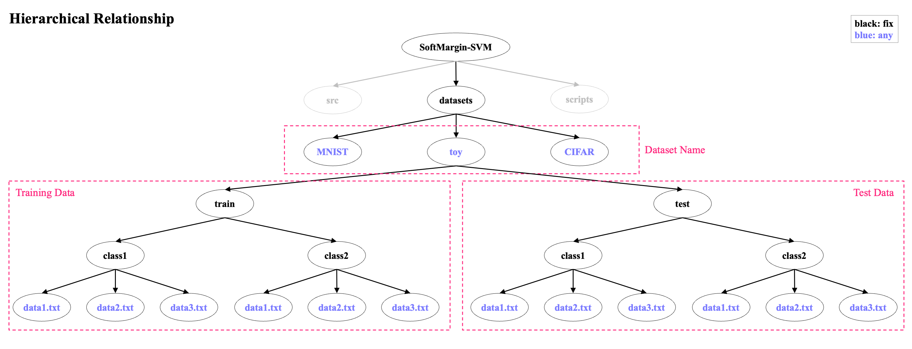

# Soft Margin SVM

This is the implementation of Soft Margin SVM (Soft Margin Support Vector Machine).

- Class: 2
- Problem: Linearly Non-separable
- Decision Boundary: Hyperplane

## Usage

### 1. Build
Please build the source file according to the procedure.
~~~
$ mkdir build
$ cd build
$ cmake ..
$ make
$ cd ..
~~~

### 2. Dataset Setting

The following hierarchical relationships are recommended.

### 3. Execution

The following is an example for Toy Dataset.

#### Setting
Please set the shell for executable file.
~~~
$ vi scripts/toy.sh
~~~
If you want to view specific examples of command line arguments, please view "src/main.cpp" or add "--help" to the argument.
~~~
#!/bin/bash

DATA='toy'

./SoftMargin-SVM \
    --dataset ${DATA} \
    --nd 2 \
    --C 10.0 \
    --lr 0.0001
~~~

#### Run
Please execute the following to start the program.
~~~
$ sh scripts/toy.sh
~~~

## Formula

## Algorithm

